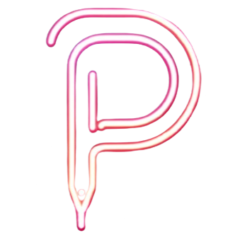
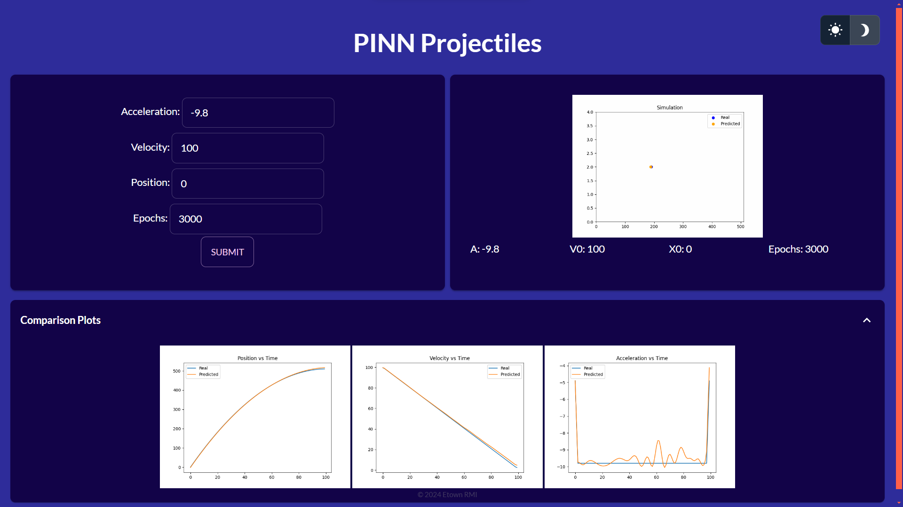

<a name="readme-top"></a>

[![Contributors][contributors-shield]][contributors-url]
[![Forks][forks-shield]][forks-url]
[![Stargazers][stars-shield]][stars-url]
[![Issues][issues-shield]][issues-url]
[![MIT License][license-shield]][license-url]


<!-- PROJECT LOGO -->
<br />
<div align="center">
  <a href="https://github.com/etown-rmi/PINN-Projectiles">
    
  </a>
<h3 align="center">PINN-Projectiles</h3>
  <p align="center">
    A python engine to create and test Go Fish bots
    <br />
    <a href="https://github.com/etown-rmi/PINN-Projectiles/wiki"><strong>Explore the docs »</strong></a>
    <br />
    <br />
    <a href="https://github.com/etown-rmi/PINN-Projectiles/issues">Report Bug</a>
    ·
    <a href="https://github.com/etown-rmi/PINN-Projectiles/issues">Request Feature</a>
  </p>
</div>


<!-- TABLE OF CONTENTS -->
<details>
  <summary>Table of Contents</summary>
  <ol>
    <li>
      <a href="#about-the-project">About The Project</a>
      <ul>
        <li><a href="#built-with">Built With</a></li>
      </ul>
    </li>
    <li>
      <a href="#getting-started">Getting Started</a>
      <ul>
        <li><a href="#prerequisites">Prerequisites</a></li>
        <li><a href="#installation">Installation</a></li>
      </ul>
    </li>
    <li><a href="#contributing">Contributing</a></li>
    <li><a href="#license">License</a></li>
    <li><a href="#contact">Contact</a></li>
  </ol>
</details>


<!-- ABOUT THE PROJECT -->
## About The Project



<p align="right">(<a href="#readme-top">back to top</a>)</p>


### Built With

* Taipy
* Matplotlib
* Pinns
* Gif


<p align="right">(<a href="#readme-top">back to top</a>)</p>


<!-- GETTING STARTED -->
## Getting Started

To get a local copy up and running follow these simple example steps.

### Prerequisites

* [Python 3.8-3.11](https://www.python.org/downloads/)

### Installation

1. Clone the repository
   ```sh
   git clone https://github.com/etown-rmi/PINN-Projectiles
   ```
2. Navigate to src and Install Dependencies
    ```bash
    cd ./src
    pip install -r ./requirements.txt
    ```
3. Run the main file
    ```bash
    python main.py
    ```
   

<p align="right">(<a href="#readme-top">back to top</a>)</p>


<!-- CONTRIBUTING -->
## Contributing

Contributions are what make the open source community such an amazing place to learn, inspire, and create. Any contributions you make are **greatly appreciated**.

If you have a suggestion that would make this better, please fork the repo and create a pull request. You can also simply open an issue with the tag "enhancement".
Don't forget to give the project a star! Thanks again!

1. Fork the Project
2. Create your Feature Branch (`git checkout -b feature/AmazingFeature`)
3. Commit your Changes (`git commit -m 'Add some AmazingFeature'`)
4. Push to the Branch (`git push origin feature/AmazingFeature`)
5. Open a Pull Request

<p align="right">(<a href="#readme-top">back to top</a>)</p>


<!-- LICENSE -->
## License

Distributed under the MIT License. See `LICENSE.txt` for more information.

<p align="right">(<a href="#readme-top">back to top</a>)</p>


<!-- CONTACT -->
## Contact

Etown RMI Club - rmi@etown.edu

Project Link: [https://github.com/etown-rmi/PINN-Projectiles](https://github.com/etown-rmi/PINN-Projectiles)

<p align="right">(<a href="#readme-top">back to top</a>)</p>


<!-- ACKNOWLEDGMENTS -->
<!-- ## Acknowledgments -->

<!-- <p align="right">(<a href="#readme-top">back to top</a>)</p> -->


<!-- MARKDOWN LINKS & IMAGES -->
<!-- https://www.markdownguide.org/basic-syntax/#reference-style-links -->
[contributors-shield]: https://img.shields.io/github/contributors/etown-rmi/PINN-Projectiles.svg?style=for-the-badge
[contributors-url]: https://github.com/etown-rmi/PINN-Projectiles/graphs/contributors
[forks-shield]: https://img.shields.io/github/forks/etown-rmi/PINN-Projectiles.svg?style=for-the-badge
[forks-url]: https://github.com/etown-rmi/PINN-Projectiles/network/members
[stars-shield]: https://img.shields.io/github/stars/etown-rmi/PINN-Projectiles.svg?style=for-the-badge
[stars-url]: https://github.com/etown-rmi/PINN-Projectiles/stargazers
[issues-shield]: https://img.shields.io/github/issues/etown-rmi/PINN-Projectiles.svg?style=for-the-badge
[issues-url]: https://github.com/etown-rmi/PINN-Projectiles/issues
[license-shield]: https://img.shields.io/github/license/etown-rmi/PINN-Projectiles.svg?style=for-the-badge
[license-url]: https://github.com/etown-rmi/PINN-Projectiles/blob/master/LICENSE.txt
[product-screenshot]: images/screenshot.png
